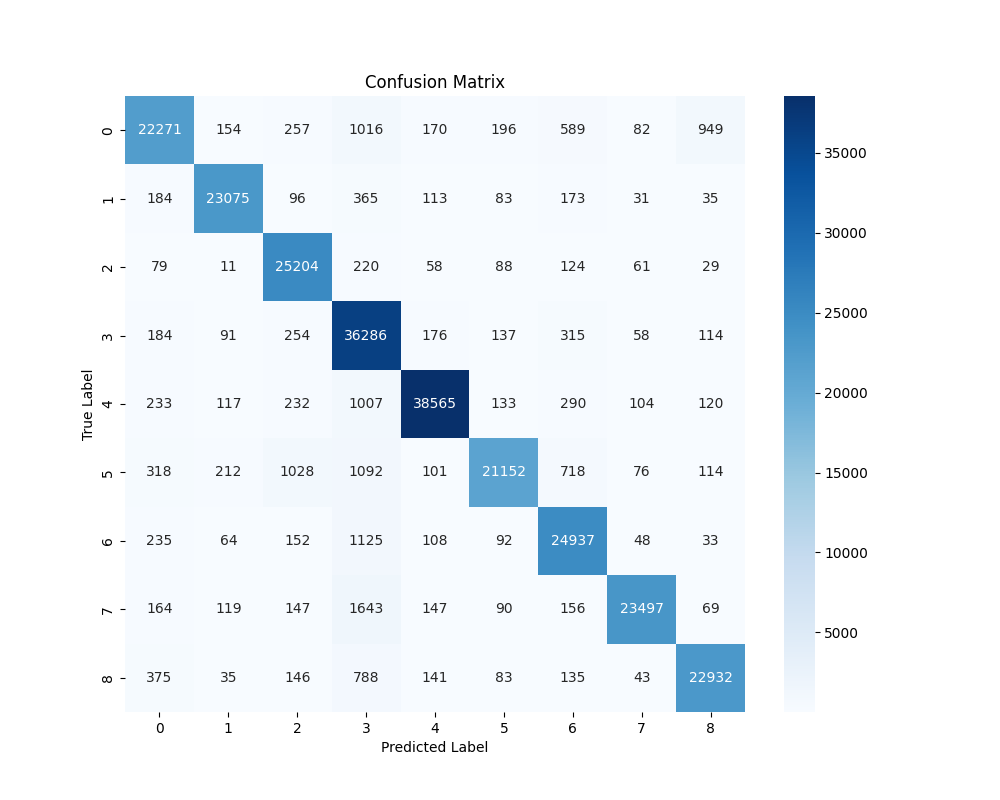
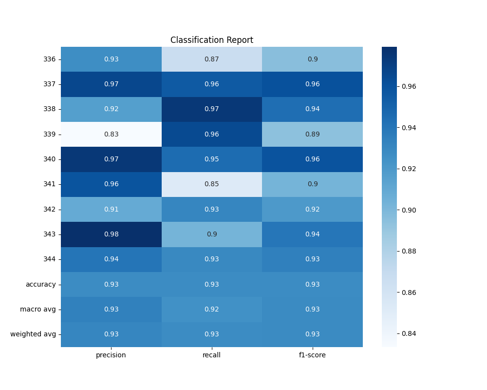
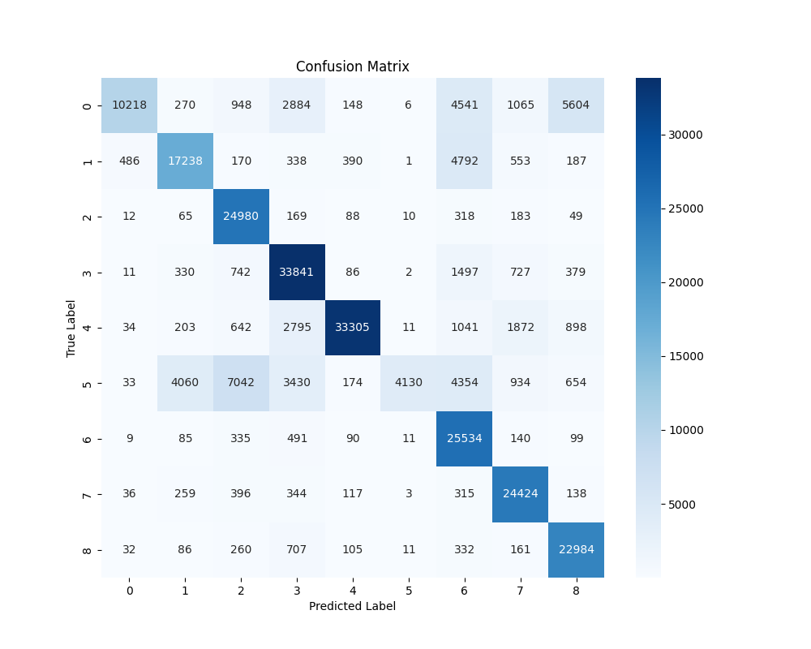
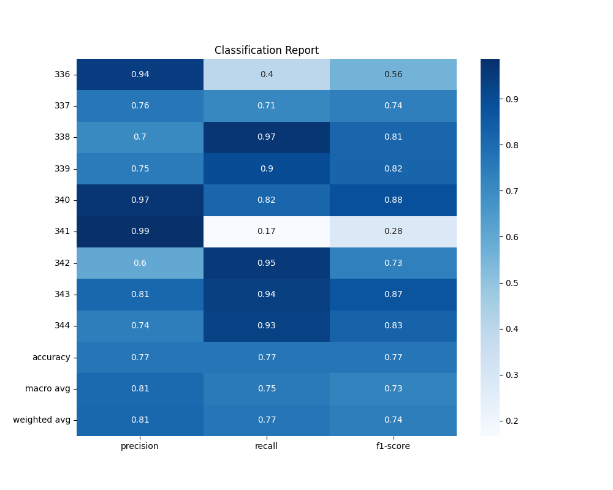

  <h1>Doodle</h1>
  
  
   
  <em>made by Shaunik Musukula</em>

---

## 📚 Table of Contents
- [🏗️ Model Architecture](#model-architecture)
- [📊 Benchmarks](#benchmarks)
- [🙏 Acknowledgments](#acknowledgments)

---

## 🏗️ Model Architecture

The project explores two model architectures for image classification tasks:

### 👁️ CNN Architecture
The CNN model is structured with 3 convolutional blocks followed by fully connected layers. Each block consists of:

- **Convolutional Layers**: Two convolutional layers with 3x3 filters, ReLU activation, and L2 regularization to prevent overfitting.
- **Batch Normalization**: Applied after each convolutional layer to stabilize and accelerate training.
- **Max Pooling**: Reduces the spatial dimensions of the feature maps, helping to down-sample the input representation.
- **Dropout**: Used to prevent overfitting by randomly setting a fraction of input units to 0 at each update during training.

The final layers include:

- **Flatten Layer**: Converts the 2D matrix into a vector.
- **Dense Layers**: A fully connected layer with 512 units and ReLU activation, followed by a dropout layer.
- **Output Layer**: A dense layer with a softmax activation function to output probabilities for each class.

The model is compiled with the **Adam optimizer** and uses **sparse categorical cross-entropy** as the loss function, with **accuracy** as the evaluation metric.

### 🪶 MobileNet2.0 Architecture
This architecture builds upon MobileNet2.0, focusing on reducing complexity while maintaining high accuracy:

- **Depthwise Separable Convolutions**: Utilized to decompose standard convolutions into a depthwise convolution followed by a pointwise convolution, significantly reducing the number of parameters and computational cost.
- **Inverted Residuals with Linear Bottlenecks**: Implemented to enhance feature reuse and maintain a lightweight model structure. This involves using shortcut connections between bottleneck layers.
- **Global Average Pooling**: Applied to the output of the feature extractor to reduce the spatial dimensions and prepare for the dense layers.
- **Dense Layers**: A fully connected layer with 512 units and ReLU activation, followed by a dropout layer to mitigate overfitting.
- **Output Layer**: A dense layer with a softmax activation function to output class probabilities.

The model is compiled with the **Adam optimizer** and uses **sparse categorical cross-entropy** as the loss function, with **accuracy** as the evaluation metric.

---

## 📊 Benchmarks

### 📈 MobileNet2.0 Inspired Benchmarks
- **Test Loss**: 0.25598567724227905
- **Test Accuracy**: 0.9277620315551758

### 📉 CNN Benchmarks
- **Test Loss**: 0.8327332735061646
- **Test Accuracy**: 0.7668496966362

### 🔍 Comparison
The MobileNet2.0-inspired architecture performs better than the traditional CNN model, with a test accuracy of 92.78% and a test loss of ~0.256, compared to the CNN's 76.68% accuracy and ~0.833 loss. This is due to the use of depthwise separable convolutions and inverted residuals, which improve efficiency in image classification.

---

## 🙏 Acknowledgments

This project uses the [Quick, Draw! Dataset](https://quickdraw.withgoogle.com/data) provided by Google. I went ahead and downloaded the dataset and compiled it into an `npz` file. You can access it [here](https://drive.google.com/drive/folders/1eCo87_mNv0MAS-3zTeKbxPg8cCcrVFNH).
