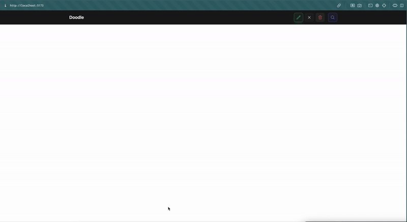
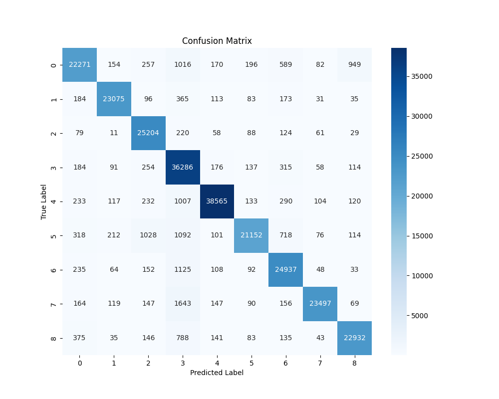
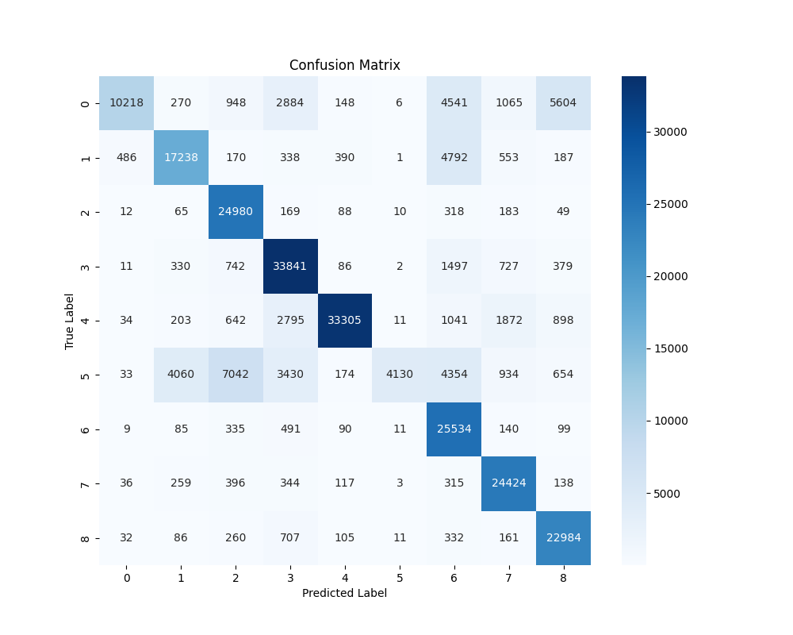
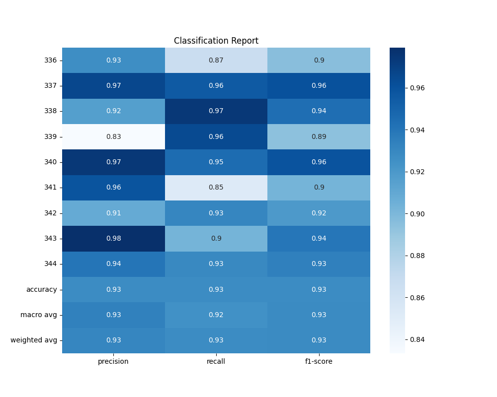
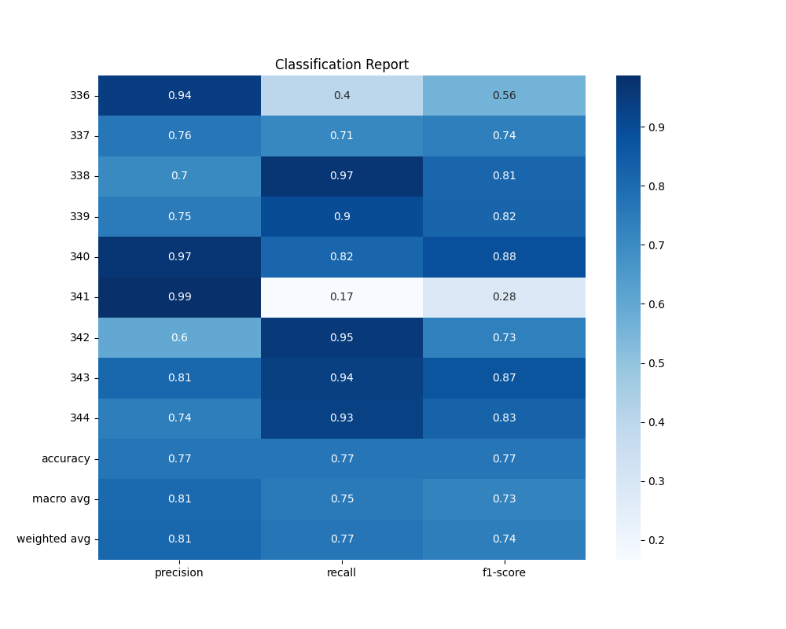

<div align="center">
  
  <h1>Doodle</h1>
  
  [](https://github.com/shaunikm/doodle)
  [](LICENSE)
  [](https://tensorflow.org)
  [](https://reactjs.org/)
  [](https://vitejs.dev/)
  <sub>Created by Shaunik Musukula</sub></p>
</div>
<div align="center">
  
  <p><small><em>Ignore the horrible drawing</em></small></p>
</div>


---

## 📚 Table of Contents
- [<code>⚙️ Installation</code>](#-installation)
- [<code>🏗️ Model Architecture</code>](#-model-architecture)
  - [<code>🧠 MobileNet2.0 Architecture</code>](#-mobilenet20-architecture)
  - [<code>👁️ CNN Architecture</code>](#-cnn-architecture)
- [<code>📊 Benchmarks</code>](#-benchmarks)
  - [<code>🚀 Performance Summary</code>](#-performance-summary)
  - [<code>🔍 Visual Comparisons</code>](#-visual-comparisons)
- [<code>🙏 Acknowledgments</code>](#-acknowledgments)

---

## ⚙️ Installation

To set up the project, follow these steps for both the `app` and `model` folders:

### Prerequisites

- Ensure you have Node.js and npm installed for the `app` folder.
- Ensure you have Python 3.10 and pip installed for the `model` folder.

### Setting up the `app` folder

1. Nav to the `app` directory:
   ```bash
   cd app
   ```

2. Install dependencies:
   ```bash
   npm install
   ```

3. Start the dev server:
   ```bash
   npm run dev
   ```

### Setting up the `model` folder

1. Nav to the `model` directory:
   ```bash
   cd model
   ```

2. Create a virtual environment (with Python 3.10):
   ```bash
   python -m venv your_env_name
   ```

3. Activate the virtual environment:

   - On Windows:
     ```bash
     venv\Scripts\activate
     ```

   - On macOS/Linux:
     ```bash
     source venv/bin/activate
     ```

4. Install packages:
   ```bash
   pip install -r requirements.txt
   ```

5. You're all set! :)

---

## 🏗️ Model Architecture

My project explores two model architectures for image classification tasks:

### [🧠 MobileNet2.0 Architecture](model/model/model.keras)
You can view the source code [here](model/model.py). This architecture builds upon MobileNet2.0, focusing on reducing model complexity while maintaining high accuracy:

- **Depthwise Separable Convolutions**: Utilized to decompose standard convolutions into a depthwise convolution followed by a pointwise convolution, significantly reducing the number of parameters and computational cost.
- **Inverted Residuals with Linear Bottlenecks**: Implemented to enhance feature reuse and maintain a lightweight model structure. This involves using shortcut connections between bottleneck layers.
- **Global Average Pooling**: Applied to the output of the feature extractor to reduce the spatial dimensions and prepare for the dense layers.
- **Dense Layers**: A fully connected layer with 512 units and ReLU activation, followed by a dropout layer to mitigate overfitting.
- **Output Layer**: A dense layer with a softmax activation function to output class probabilities.

The model is compiled with the **Adam optimizer** and uses **sparse categorical cross-entropy** as the loss function, with **accuracy** as the evaluation metric.

### [👁️ CNN Architecture](model/model/cnn.keras)
The CNN model is structured with 3 convolutional blocks followed by fully connected layers. Each block consists of:

- **Convolutional Layers**: Two convolutional layers with 3x3 filters, ReLU activation, and L2 regularization to prevent overfitting.
- **Batch Normalization**: Applied after each convolutional layer to stabilize and accelerate training.
- **Max Pooling**: Reduces the spatial dimensions of the feature maps, helping to down-sample the input representation.
- **Dropout**: Used to prevent overfitting by randomly setting a fraction of input units to 0 at each update during training.

The final layers include:

- **Flatten Layer**: Converts the 2D matrix into a vector.
- **Dense Layers**: A fully connected layer with 512 units and ReLU activation, followed by a dropout layer.
- **Output Layer**: A dense layer with a softmax activation function to output probabilities for each class.

The model is compiled with the **Adam optimizer** and uses **sparse categorical cross-entropy** as the loss function, with **accuracy** as the evaluation metric.

---

## 📊 Benchmarks

### 📈 Performance Summary

| Model                | Test Loss | Test Accuracy |
|----------------------|-----------|---------------|
| 🧠 MobileNet2.0         | ~0.256     | 92.78%        |
| 👁️ CNN                  | ~0.833     | 76.68%        |

The MobileNet2.0 architecture performs better than the CNN, with a test accuracy of 92.78% and a test loss of ~0.256, compared to the CNN's 76.68% accuracy and ~0.833 loss. This is probably due to the use of depthwise separable convolutions and inverted residuals, which improve efficiency in image classification.

### 🔍 Visual Comparisons

| MobileNet2.0 Confusion Matrix | CNN Confusion Matrix |
|-------------------------------|----------------------|
|  |  |

| MobileNet2.0 Classification Report | CNN Classification Report |
|------------------------------------|---------------------------|
|  |  |

---

## 🙏 Acknowledgments

This project uses the [Quick, Draw! Dataset](https://quickdraw.withgoogle.com/data) provided by Google. I went ahead and downloaded the dataset and compiled it into an `npz` file. You can access it [here](https://drive.google.com/drive/folders/1eCo87_mNv0MAS-3zTeKbxPg8cCcrVFNH).
